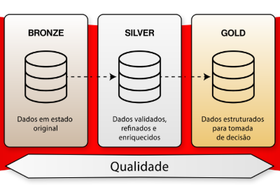
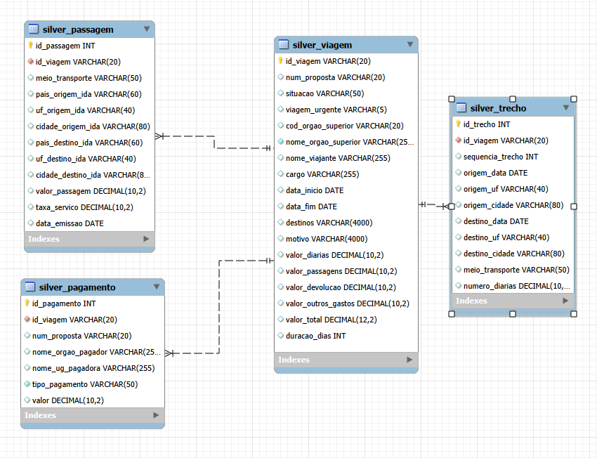
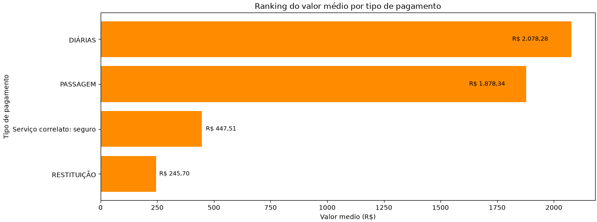

**Gustavo Giacomini**

**Análise de Dados (Turma 2)**

# Pipeline de Gastos Públicos com Viagens

## Sobre o projeto

Este projeto foi desenvolvido como atividade avaliativa do curso de Análise de Dados do SCTEC.

O desafio consiste em desenvolver um pipeline de dados de ponta a ponta utilizando Python e MySQL, seguindo a Arquitetura Medallion (Raw, Silver e Gold). O pipeline realiza a extração automatizada dos dados de Viagens a Serviço do Portal da Transparência do Governo Federal, preserva os dados originais na camada Raw, realiza a limpeza, tipagem e modelagem na camada Silver e, por fim, gera consultas, métricas e visualizações na camada Gold. Para a realização da atividade, foi utilizada uma base de dados disponibilizada em um arquivo .zip hospedado no Google Drive, contendo informações referentes aos seis primeiros meses de 2025.


---

## Objetivos

- Automatizar a extração e a carga dos dados provenientes do Portal da Transparência.
- Preservar os dados originais na camada **Raw**, garantindo sua integridade e rastreabilidade.
- Realizar a limpeza, padronização e tipagem dos dados na camada **Silver**.
- Implementar a modelagem relacional utilizando **MySQL**, com definição de chaves primárias, chaves estrangeiras e constraints.
- Construir a camada **Gold** com consultas, agregações e visualizações para apoio à tomada de decisão.
- Responder às perguntas de negócio propostas utilizando **SQL** e **Python**.

---

## Tecnologias utilizadas

- Python
- MySQL
- SQL
- Pandas
- Matplotlib
- mysql-connector-python
- GitHub

---

## Etapas do Pipeline

### Fase 0 - Banco e tabelas (0_criar_banco.sql)

- Criação do banco de dados.
- Criação das 4 tabelas Raw.
- Criação das 4 tabelas Silver.
- Definição de PK, FK e Constraints.

### Fase 1 - Extração e camada Raw (1_extrair.py)

- Download do arquivo ZIP.
- Leitura dos arquivos CSV sem alterar o conteúdo.
- Inserção dos dados na camada Raw.

### Fase 2 - Transformação e camada Silver (2_transformar.py)

- Conversão dos tipos para DATE e DECIMAL
- Cálculo dos colunas:
  - valor_total
  - duracao_dias
- Inserção dos dados na camada Silver.

### Modelo relacional da camada Silver


### Fase 3 - Análise e gráficos (3_analise.ipynb)

- Consultas SQL.
- Criação da camada Gold.
- Geração de gráficos.
- Resposta às perguntas de negócio.

### Exemplo de Gráfico - valor médio por tipo de pagamento

---

## Perguntas de negócio respondidas

- Quais são os 5 órgãos com maior custo total?
- Quais são os 3 destinos com maior custo médio?
- Qual foi a viagem de maior duração?
- Qual tipo de pagamento possui maior valor médio?
- Qual meio de transporte é mais utilizado?
- Qual UF aparece em maior número de trechos?
- Qual órgão realizou o maior volume de pagamentos?

---

## Como executar

### 1. Clone o repositório

```bash
git clone https://github.com/gtvgiaco/PIPELINE_GASTOS_PUBLICOS_VIAGENS.git
```

### 2. Instale as dependências

```bash
pip install -r requirements.txt #para instalar automaticamente as bibliotecas
```

### 3. Configure o arquivo `.env`

Informe as credenciais do banco de dados.

### 4. Execute o script SQL

```
0_criar_banco.sql
```

### 5. Execute os arquivos na ordem

```
1_extrair.py


2_transformar.py


3_analise.ipynb
```

---

## Principais técnicas utilizadas

- ETL (Extract, Transform, Load)
- Arquitetura Medallion
- Modelagem Relacional
- Integridade Referencial
- Constraints
- JOIN
- GROUP BY
- Views
- Agregações
- Visualização de Dados

---

## Conclusão

O projeto demonstra a construção completa de um pipeline de dados utilizando Python e SQL, desde a extração de dados brutos até a geração de informações consolidadas para apoio à tomada de decisão. A utilização da Arquitetura Medallion garante maior organização, rastreabilidade e qualidade dos dados ao longo de todo o processo.

---


